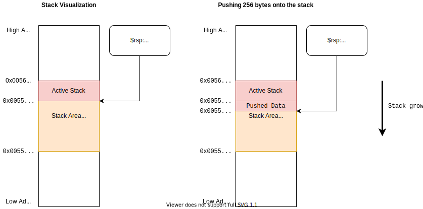
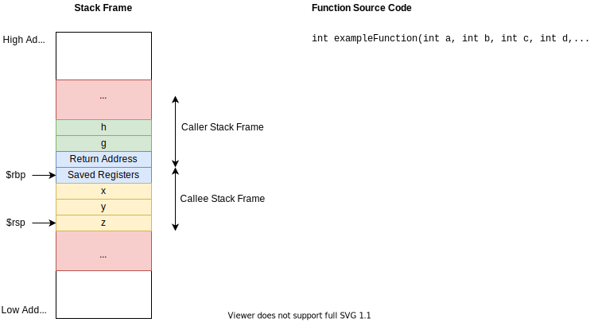

# Exploitation Exercise with unsafe.Pointer in Go: Information Leakage

May 11, 2020. Johannes Lauinger (johannes@lauinger-it.de)

Go in general is a safe language. It has memory builtin safety measures that should avoid common buffer overflow 
vulnerabilities, like they often exist in C programs.

The `unsafe` standard library package defeats this memory safety. With `unsafe.Pointer`, we can create a pointer of 
arbitrary type. The compiler can't and won't enforce safety measures on this type of pointer.

In this first of a four-part, weekly series on practically exploiting unsafe.Pointer usage, we will cover the possibilities
that come with `unsafe.Pointer` and look at a first potential vulnerability: an information leakage.


## Parts:

 1. Information leakage (enjoy!)
 2. [Code flow redirection](unsafe-vulnerabilities-2-code-flow-redirection.md)
 3. [ROP and spawning a shell](unsafe-vulnerabilities-3-rop-and-spawning-a-shell.md)
 4. [SliceHeader literals](unsafe-vulnerabilities-4-sliceheader-literal.md)


## What is this about?

So why did I write this blog post? I am a computer science student at TU Darmstadt, Germany. I am currently writing my
Master's thesis on an analysis of real-world usage patterns of the Go `unsafe` package. As part of the research, I look
into actual use cases of `unsafe.Pointer` references in the biggest open source Go projects, analyze and categorize them,
and identify potentially dangerous patterns and vulnerabilities.

As a first step in finding out which usage patterns are dangerous, I created some artificial proof of concepts that
demonstrate applications that are vulnerable due to a wrong use of `unsafe.Pointer`. While doing this, I figured this
could be an interesting read or even short exercise for Go developers.

So grab your favorite beverage, fire up your code editor of choice, and enjoy this little journey covering different
types of vulnerabilities. We will look at the exact problem in the code and explain why it arises, and discuss possible
means of introducing such a problem in the real world.


## Buffer overflows, part 1: the stack layout 

Let's start with a short discussion of the stack. A stack is a data structure that grows like a tower of things. New 
items can be pushed onto the stack, and items on the stack can be removed or popped. A CPU uses a stack to keep track 
of data that is meaningful in the current context. Most importantly, it is used for calling functions. The stack used 
in the `x86_64` architecture is an area in the RAM which is identified by the stack pointer register `$rsp`.

Pushing something onto the stack is done be decrementing the stack pointer by some amount, e.g. a processor word (8 byte
on 64-bit architecture). Then the data is written to the address where the stack pointer now points to. Decrementing the
stack pointer marks the memory region as belonging to the stack. When popping values from the stack, the stack pointer
is incremented again, marking the memory region as free again. Because the stack pointer decrements with new data, we
can say that the stack grows to the bottom, starting from high addresses in memory and growing to low addresses.



When the current program calls a function, the return address as well as some function parameters (more on this in part
3 of this series) are pushed onto the stack, and the processor jumps to the first instruction of the function. This jump is done
by setting the instruction pointer register `$rip`. Then, when the function returns (by executing the `ret` instruction),
the return address is popped from the stack and put into the `$rip` register. More on this can be read in [[2]](#references).

The function can store local variables on the stack (inside its so-called stack frame). These are pushed onto the stack
after the return address and saved registers, meaning the variables are at lower memory addresses than the return 
address. Furthermore, variables on the stack are located directly next to each other. This is why bounds checking is 
very important for buffers. Reading or writing outside the bounds of a variable means we are reading or writing other 
variables. We call this buffer overflow.

This is a visualization of a stack frame for a function:




## Go memory safety

Go employs some safety techniques that prevent buffer overflows, among other vulnerabilities. The type system strictly
encodes the buffer length of variables, e.g. we have `[8]byte` and `[16]byte` as completely different types with no
casting from the short buffer to the long buffer. This prevents the misuse of memory regions which will eventually lead
to a potentially exploitable buffer overflow.

Dangerous operations common to C programs such as pointer casting and the infamous, no-bounds-checking `gets()` function
are therefore impossible with safe Go programs.

However, there exists the `unsafe` package and with it the `unsafe.Pointer` type [[1]](#references). This pointer type 
is special in that it can participate in type operations that would otherwise be forbidden:

 1. we can cast any pointer type into `unsafe.Pointer`
 2. we can cast `unsafe.Pointer` into any pointer type
 3. we can cast `unsafe.Pointer` into `uintptr`, which is essentially the address as an integer
 4. we can cast `uintptr` into `unsafe.Pointer`
 
Points 1 and 2 allow type-casting between arbitrary types, and points 3 and 4 allow pointer arithmetic. With these
powers however comes great responsibility: using them removes the safety net of Go, meaning we're back at the security
madness of plain C code. The `unsafe` package must therefore be used only with extreme caution.

In the following proof of concepts, we will demonstrate some of the potential vulnerabilities that can be introduced
surprisingly fast when using `unsafe.Pointer`.


## Information leakage POC

In this short proof of concept, let's assume there is a buffer of harmless, public data. It is called `harmlessData`
and it might store e.g. the version of the program, or the public display name of a logged-in user.

Behind it, there is a declaration of a secret data buffer. For the sake of the argument, imagine that it might be some
private information about a logged-in user, e.g. their password hash or a certificate private key.

```go
func main() {
    // this could be some public information, e.g. version information
    harmlessData := [8]byte{'A', 'A', 'A', 'A', 'A', 'A', 'A', 'A'}
    // however, this could be critical private information such as a private key
    secret := [17]byte{'l', '3', '3', 't', '-', 'h', '4', 'x', 'x', '0', 'r', '-', 'w', '1', 'n', 's', '!'}
    
    // ...
}
```

Next, the buffer is cast. Using the `unsafe.Pointer` type, we can do any type casting we want, defeating the Go memory
safety measures. Here, we cast the buffer into a new byte buffer, but with a bigger size. After this, we print the new
(dangerous) buffer.

```go
    // ...
    // (accidentally) cast harmless buffer into a new buffer type of wrong size
    var dangerousData = (*[8+17]byte)(unsafe.Pointer(&harmlessData[0]))
    
    // print (misused) buffer
    fmt.Println(string((*dangerousData)[:]))
}
```

Running this script will read the newly created, dangerous buffer. The length information will be inappropriate, and 
thus the program will read memory after the end of the harmless data, revealing the secret data:

```shell
$ go run main.go 
AAAAAAAAl33t-h4xx0r-w1ns!
```

This is an information leak, because we read and send more data than we wanted.

But how could this ever happen? Let's assess a threat model!


## Threat model

Admittedly, when the buffer definition and cast are located very close to each other, it is hard to imagine that such
a bug would go unnoticed in a production software project. But I would argue that it is far less unlikely for such 
mistakes to happen if we add some human factors into the equation.

Imagine you work at a large software company which is building some application that has a client/server communication
model. The development of the server and client applications has been separated into different teams, and you work in
the server team. Now, at some meeting a couple of months ago, you and your colleagues drafted and agreed upon an API
specification for the binary communications protocol that you want to use between the client and server. The protocol
features a request definition that the client sends to the server. The request data is serialized into a binary stream.
Its structure looks like this:


It is a super simple protocol that doesn't even feature variable-length messages. It is just a static byte object with
a version, message type, and the actual data. Similar to the request, there is also a response type that looks the same.
Now, you and your team printed the diagram weeks ago and put it on your wall to ensure all developers can see it promptly.
But what none of you realized is that the client development team agreed on a new version of the protocol, which has a
256 bytes data field to reduce the over-the-wire packet size.

When you implement the server, you are now adding a simple buffer to store request and response objects for later
processing. You look at the diagram on the wall and determine that the size of protocol messages is guaranteed to be
exactly 516 byte, so initialize a `[516]byte` variable. To avoid unnecessary copying of the data structure before
reaching your buffering function, your team has decided to pass along a reference to the request object. You are using
an `unsafe.Pointer` reference to simplify casting operations. The function you are implementing looks like this:

```go
func buffer_request(req unsafe.Pointer) {
    var buf [516]byte
    buf = *(*[516]byte)(req)
    // use buf for some operations
}
```

Now, the problem is that the `req` parameter, referencing the source data structure somewhere in memory, was created
with the new protocol version in mind, i.e. the request packet only takes 260 bytes. But your new buffer is reading
516 bytes, that is 256 bytes too many! When the buffer is sent somewhere else, or shown to the user, you might read
and publish 256 extra bytes, containing potentially secret information.

A similar thing could happen in the other direction, when the response object is used.

When you push this new function, and your team does a thorough code review, all your colleagues see the buffer allocation,
immediately look at the wall and verify that the request data packet indeed takes exactly 516 bytes. None of them catches
the mistake and the software is shipped.

The problem was not a miscalculation, but a miscommunication within the organization, combined with a lack of defensive
programming techniques and a missing mindset of the dangers that come with the use of `unsafe.Pointer` references.

By the way, reading and sending more data than the correct amount might make you remember one of the most dangerous bugs
of recent times: the famous Heartbleed bug in OpenSSL [[3]](#references), where a missing bounds check cause a read
buffer overrun and leaked private information from the process memory. However, this example is different in that the
length is **not provided by an attacker**. The length information that OpenSSL failed to verify was supplied as part of
the input data to OpenSSL. Here, I crafted an example where the length mismatch is statically coded into the binary
because of a mistake the programmers made. A user-supplied length overrun is much more dangerous because it does not
cause problems in every run of the software, which makes it much harder to detect.

An example more similar to the Heartbleed bug would require a protocol definition with a `length` field, and a server
application crafting a buffer using that length information. This is possible when manually crafting slices in Go using
the `reflect.SliceHeader` structure, and we will explore that in the next part of this series!


## Proof of concept code

I published the proof of concept code for this post, as well as the code for the following parts 2 to 4, in a Github
repository:



If you'd like to check out the complete code and run it for yourself, you can save yourself some typing by using this
repository.


## Acknowledgements

This blog post was written as part of my work on my Master's thesis at the 
[Software Technology Group](https://www.stg.tu-darmstadt.de/stg/homepage.en.jsp) at TU Darmstadt.

Title picture by Maria Letta. Thanks a lot for her excellent [Free Gophers Pack](https://github.com/MariaLetta/free-gophers-pack)!


## References

 - [1] [Package unsafe](https://golang.org/pkg/unsafe/)
 - [2] [Eli Bendersky. Where the top of the stack is on x86 (2011)](https://eli.thegreenplace.net/2011/02/04/where-the-top-of-the-stack-is-on-x86/)
 - [3] [The Heartbleed Bug (CVE-2014-0160)](https://heartbleed.com/)
 - [4] [Unsafe Rust](https://doc.rust-lang.org/book/ch19-01-unsafe-rust.html)


Next week we are going to continue with part 2: Code flow redirection!
