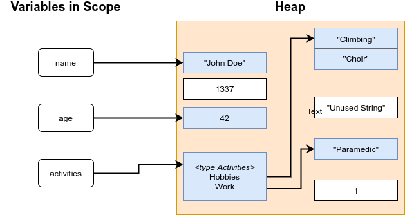

# Exploitation Exercise with Go unsafe.Pointer: Unsafe Usages of Slice Headers (Part 4)

In this fourth part, we will explore a very common, but unsafe code pattern: creating `reflect.SliceHeader` and
`reflect.StringHeader` objects from scratch instead of deriving them by cast.


## Parts:

 1. [Information leakage](unsafe-vulnerabilities-1-information-leakage.md)
 2. [Code flow redirection](unsafe-vulnerabilities-2-code-flow-redirection.md)
 3. [ROP and spawning a shell](unsafe-vulnerabilities-3-rop-and-spawning-a-shell.md)
 4. SliceHeader literals (enjoy!)


## Garbage Collection

First, let's quickly go through garbage collection. Go offers memory management to the programmer. It automatically
allocates memory for object instances or values, such as integers, slices, or structs. It also keeps track of whether
those objects are still in use, and frees the memory when they aren't anymore.

The Go garbage collector runs in the background as its own Goroutine. In fact it's several Goroutines. The garbage
collector can be triggered manually by calling `runtime.GC()`, but usually it runs automatically when the heap doubles
its size. This size threshold can be adjusted with the `GOGC` environment variable. It is set to a percentage. The
default is 100, meaning the heap has to grow by 100% to trigger the garbage collection. Setting it to 200 for example
would mean that the collection is only started when the heap has grown to three times the previous size. On top of the
size condition there is also a timing condition: as long as the process is not suspended, the garbage collector will run
at least once every two minutes.

Go uses a [Mark-and-Sweep garbage collector](https://en.wikipedia.org/wiki/Tracing_garbage_collection). This type of
garbage collection consists of two phases:

 1. Mark: by recursively following all references, starting from variables in scope, reachable heap objects are marked
 2. Sweep: objects that are not marked are freed
 
These steps can be seen in the following figure:



The light blue boxes in the heap are objects that are reachable (through the references shown by the arrows). The white
objects are unreachable and will be freed in the sweep phase.


## Explicit casting using unsafe pointers

Now, we will look at the most common usage pattern for `unsafe.Pointer` in real-world open-source Go code: casting a
slice of some type or string into a slice of some other type. Let's say we wanted to convert a string to a `[]byte`
slice in-place, that is reusing the string memory instead of copying it into a new slice allocation.

A frequent pattern to do this looks like this:

```go
func unsafeStringToBytes(s *string) []byte {
	sh := (*reflect.StringHeader)(unsafe.Pointer(s))
	sliceHeader := &reflect.SliceHeader{
		Data: sh.Data,
		Len:  sh.Len,
		Cap:  sh.Len,
	}
	return *(*[]byte)(unsafe.Pointer(sliceHeader))
}
```

The function gets a `*string` pointer (sometimes it will also be a direct `string`) and returns a `[]byte` slice. Let's
look at what it does, line by line.

First, a `reflect.StringHeader` is created from the string. The `StringHeader` is Go's internal representation of a
string. It is very similar to the `reflect.SliceHeader` that we saw in the previous posts of this series:

```go
type StringHeader struct {
    Data uintptr
    Len  int
}
```

The only difference is that there is no `Cap` field. In fact, strings in Go are by most means just a read-only `[]byte` 
slice. There are some differences, for example that `range` will iterate over runes instead of bytes, where a rune is
a Unicode code point. Because strings in Go are encoded in UTF-8, a Unicode code point might need multiple bytes (like
the German umlaut `ä`), and in that case `range` will read multiple bytes in one iteration. But in other ways, like the
length, strings behave like `[]byte` slices. For example, `len("ä")` is 2, even if the string has only one character.
You can read more on this topic in the [Go strings documentation](https://blog.golang.org/strings).

When we have a variable of type `string` in Go, it points to a `reflect.StringHeader` structure, which in turn has a
pointer to the underlying `byte`-array holding the string data in its `Data` field. To get the `StringHeader`, we cast
it from an `unsafe.Pointer` which in turn is created by casting the string pointer. If the function would have received
a `string` instead of `*string`, we would have needed to do `unsafe.Pointer(&s)` here, but the rest would stay the same.

Now, a `*reflect.SliceHeader` is created from scratch, by a composite literal. The `Data` and `Len` fields are just
copied from the `StringHeader`, and `Cap` is set to the same value as `Len`.

Lastly, we cast the `*reflect.SliceHeader` into a `*[]byte`, again using an intermediate `unsafe.Pointer` object. The
`*[]byte` is dereferenced and returned.

Thus the function is casting a `string` into a `[]byte` object. 


## First problem: implicit read-only slices

Remember that the Go documentation said that strings
are **read-only** `[]byte` slices? Well, that could turn into a problem here! The `[]byte` object returned by the
function is not read-only anymore, so the compiler will not complain if we modify its contents:

```go
func main() {
    s := "Hello"
    b := unsafeStringToBytes(&s)
    
    b[1] = "a" // this will crash
    
    fmt.Println(b)
}
```

The reason strings are read-only is because when we create a string like in the example above, the actual string literal
(the `Hello` data) is placed in a special section in the binary file produced by the compiler. When the program is run,
this section is probably mapped into a read-only memory page. Therefore, the `Data` field in the `StringHeader` and
`SliceHeader` structures will contain an address inside that read-only page.

If we now change the slice with `b[1] = "a"`, we attempt to change a read-only memory page. The operating system will 
prevent this and the result is a `SIGSEGV` segmentation fault, crashing the program.

The fact that this is a memory access violation that the compiler will not notice since we skipped its checks when we
used `unsafe.Pointer` is unfortunate, but a careful programmer could in theory make sure that all usages of the unsafe
cast function will never change the resulting slice. At all. I think this is a pretty dangerous assumption to make and
sooner or later there will be a programmer adding code that changes the slice. Therefore the casting pattern above
should be avoided at all costs.

But there is a second, much more subtle and dangerous problem in the code above.


## Garbage collector race introduced by slice and string header literals

Rule 6 of the [`unsafe` package documentation](https://golang.org/pkg/unsafe/) specifically states that "A program 
should not declare or allocate variables of these struct types." Why is that?

When the garbage collector runs the mark phase, it follows pointer references to recursively mark the objects referenced
by the pointer. An `unsafe.Pointer` and the address stored in the `Data` field of a valid `StringHeader` or `SliceHeader`
will do the same. This means that `sh.Data` in the unsafe function above will in fact be treated as a reference value,
therefore the garbage collector will not free the underlying array.

However, plain `uintptr` and invalid slice or string header values are not treated as references.

Whenever the address of a value is only stored in variable of type `uintptr` (not additionally in any pointer types),
the garbage collector will not mark the referenced object and therefore free it. The freed memory might be reused with
new variables, or the memory page might simply be unmapped, or anything else might happen. Importantly, objects that are
only reachable by using an address that was stored in a `uintptr` variable must be treated as gone.

Unsafe usage rule 2 states that only a "conversion of an `unsafe.Pointer` to a `uintptr` (but not back to `Pointer`)" 
is allowed. The part in parenthesis is important. If we create an `unsafe.Pointer` object from a previously stored 
`uintptr` value, that `unsafe.Pointer` is a potentially dangling pointer, and dereferencing is not a safe operation!

There are some cases where `unsafe.Pointer` objects are created from pointer arithmetic on `uintptr` values, but those
calculations must happen in the same statement as creating the pointer. We must never store a reference to something
only in a `uintptr` value.

Now, let's revisit the code example above.

```go
func unsafeStringToBytes(s *string) []byte {
	sh := (*reflect.StringHeader)(unsafe.Pointer(s))
	sliceHeader := &reflect.SliceHeader{
		Data: sh.Data,
		Len:  sh.Len,
		Cap:  sh.Len,
	}
    
    // At this point, s is no longer used. There is a copy of the address of
    // its underlying array in sliceHeader.Data however, and since sliceHeader
    // was not created from an actual slice, the GC does not treat the address
    // as a reference. Therefore, if the GC runs here it will free s.

	return *(*[]byte)(unsafe.Pointer(sliceHeader))
}
```

At the point of the comment, the garbage collector can potentially run. Remember that it is triggered by heap usage
growth, and runs concurrently. If the function is used within a program that uses several Goroutines, the garbage
collector can essentially trigger at any point, including the one with the comment.

When it runs, it will free string `s` because it is no longer used. When the `[]byte` slice is created in the next line,
its `Data` field will contain an invalid address. It might now point to an unmapped memory page, or simply to some
undefined position in the heap that might get reused later on.


## PoC: Exploiting this GC race condition

To see what can happen with this, let's look at the following proof-of-concept code. First, I add the following line
at the position of the comment above:

```go
    time.Sleep(1 * time.Nanosecond)
``` 

This just makes the exploit a bit more reliable, but is not strictly needed. Next, I add a Goroutine that will just use
up more and more heap and constantly drop the references to that allocated memory. This will regularly trigger the
garbage collector.

```go
func heapHeapHeap() {
	var a *[]byte
	for {
		tmp := make([]byte, 1000000, 1000000)
		a = &tmp
        _ = a
	}
}
```

Finally, the main Goroutine does the following:

```go
reader := bufio.NewReader(os.Stdin)
count := 1
var firstChar byte

for {
    s, _ := reader.ReadString('\n')
    if len(s) == 0 {
        continue
    }
    firstChar = s[0]

    // HERE BE DRAGONS
    bytes := unsafeStringToBytes(&s)

    _, _ = reader.ReadString('\n')

    if len(bytes) > 0 && bytes[0] != firstChar {
        fmt.Printf("win! after %d iterations\n", count)
        os.Exit(0)
    }

    count++
}
```

It initializes a reader to read data from `stdin`. Then it repeatedly reads two lines from it in a loop. A counter is
used to count how many loops are needed to succeed. The `firstChar` variable is set to the first char from the first
line that is read.

Then, the first line (a string) is converted to a `[]byte` slice using the unsafe casting function from above. At this
point, `bytes` and `s` should be the same string. Particularly, the `bytes[0]` should equal `firstChar`.

After the conversion, the second line is read. The result from `ReadString` is not even used, but the important part of
this is that if the garbage collector was run inside `unsafeStringToBytes`, then `ReadString` will reuse the heap space
that was previously freed.

Lastly, we check if `bytes[0]` is actually equal to `firstChar`, and if it is not we have successfully created a data
confusion by exploiting a garbage collector race condition. The number of loop executions needed is printed at the end.

Running this program can have two different results:

 1. The garbage collector finds an incorrect address in the heap and crashed the program with a hint to a possible
    incorrect usage of `unsafe.Pointer`
 2. It succeeds with the `win!` message
 
As long as the garbage collector does not trigger at the critical point in the unsafe cast function, the loop will just
run forever.
 
The first, crashing case happens when the garbage collector triggers inside the unsafe cast function, and again within 
the second `ReadString` call in the PoC code. At that point, `bytes` will be a seemingly valid `[]byte` slice, but its 
`Data` field will point to previously freed memory.

The second, succeeding case will happen if the garbage collector triggers only inside the unsafe cast function. In that
case, the `bytes` slice will be a dangling slice pointing into the freed heap. Then, the second `ReadString` will reuse
that heap space, and provided that we sent a different string as second line, the first byte in the `bytes` slice will
now be a different character.

To achieve the alternating, but infinite input data I use the following Python script:

```python
#!/usr/bin/env python3

import errno
from signal import signal, SIGPIPE, SIG_DFL
signal(SIGPIPE,SIG_DFL)

try:
    while True:
        print("AAAAAAAAAAAAAAAAAAAAAAAAAAAAAAAAAA")
        print("BBBBBBBBBBBBBBBBBBBBBBBBBBBBBBBBBBB")
except Exception:
    pass
```

It simply sends alternating `A` and `B` lines, and ignores IO exceptions caused by the pipe closing abruptly when the
Go program crashes (which would spam the terminal with some Python error messages).

The PoC is run like this:

```shell
$ ./exploit.py | ./main
win! after 51446 iterations
``` 

In my experiments, the program would crash with condition 1 about 10% of the time, and succeed in 20,000 to 100,000
iterations otherwise.


## Why is this a problem? A threat model

Now, all of this might seem rather staged and a succeeding memory confusion after 50,000 iterations on average might not
seem that often either. But in fact this is probably the most dangerous vulnerability of the ones shown in this blog
series.

First, the function that contains the actual vulnerability, `unsafeStringToBytes`, is taken from real-world Go code.
There are hundreds of times this code pattern is used in open-source Go libraries, and taking into account that they
are reused across multiple projects, there are actually tens of thousands of times this is used in the 500 most starred
open-source Go projects.

Unlike in part 3 of this series, we didn't gain remote code execution with this exploit PoC. We didn't even violate the
read-only nature of the slice returned from `unsafeStringToBytes`. And the exploit is not even particularly reliable, it
takes thousands of iterations until the confusion happens once and sometimes the program even just crashes. Lastly, we
added the nanosecond sleep, further increasing the likelihood of the confusion to happen.

But risk is a combination of likelihood and impact, and the impact of this problem is potentially disastrous.

First, let's create a potential real-world use case for analysis, set the likelihood in perspective, and then talk 
about the impact. Imagine a server application written in Go. It handles incoming requests, does some internal
calculations and creates an output that is sent back to the client. Of course the application holds some private state,
imagine credentials to the database backend or private key data for example. Let's also say that there are 1,000
requests coming in each second. That number of requests is not low, but also not extremely high.

Let's ignore the case of crashing the program for now, since for this threat model assessment we can just assume that
if the server application crashes, some daemon supervisor will just restart it. We can think of the loop in the exploit
proof of concept as a similar thing to the requests that are coming in. Some code path will be executed for every
request, and this will be kind of like a loop iteration. Furthermore, if we get a memory confusion every 50,000 requests,
that will add up to a bit more than one confusion per minute. The nanosecond sleep will make the confusion more likely,
but still this might occur every few minutes.

Now, if such a memory confusion happens, there might be some read-only slice that contains unexpected data. If the
server application happens to use that slice for creating the response output that is sent to the user, even with some
intermediate conversions in between, the application might server unexpected memory contents back to the user. So with
this vulnerability in place, a user might suddenly, and randomly, get some scrambled data instead of an HTML response,
and if that user were to look into the data they might find the application secrets. This is a clear information leak
vulnerability, and the fact that it is caused by widely used code makes it very dangerous. 


## The "correct" way of in-place slice casting using the `unsafe` package

There is a "correct" way to cast slices without copying. Whether this is really worth it has to be decided in the
special case, but we can at least propose a safer version of the vulnerable casting function above.

```go
func saferStringToBytes(s *string) []byte {
    // create an actual slice
    bytes := make([]byte, 0, 0)
   
    // create the string and slice headers by casting. Obtain pointers to the headers to be able to change the slice
    // header properties in the next step
    stringHeader := (*reflect.StringHeader)(unsafe.Pointer(s))
    sliceHeader := (*reflect.SliceHeader)(unsafe.Pointer(&bytes))

    // set the slice's length and capacity temporarily to zero (this is actually unnecessary here because the slice is
    // already initialized as zero, but if you are reusing a different slice this is important
    sliceHeader.Len = 0
    sliceHeader.Cap = 0

    // change the slice header data address
    sliceHeader.Data = stringHeader.Data

    // set the slice capacity and length to the string length
    sliceHeader.Cap = stringHeader.Len
    sliceHeader.Len = stringHeader.Len

    // use the keep alive dummy function to make sure the original string s is not freed up until this point
    runtime.KeepAlive(s)  // or runtime.KeepAlive(*s)
   
    // return the valid bytes slice (still read-only though)
    return bytes
}
``` 

This is a rather complicated process, but here are the important parts:

 1. The `bytes` slice that will be returned at the end is created as an actual, valid slice using the `make` function.
    It is not created by casting a plain header structure that was created as a composite literal. This ensures that
    Go will treat the address stored in `sliceHeader.Data` as if it were a "real" pointer
 2. Subsequently, the `sliceHeader` instance is created by casting as stated in the `unsafe` documentation
 3. `sliceHeader` length and capacity are explicitly set to zero while the `Data` address still points to the old
    underlying array. This is only necessary if the slice has not just been created. Decreasing the length and capacity
    is a safe operation, and it ensures that if the garbage collector runs just after the switch of `Data` it will not
    run past the slice end. This is explained in further detail below.
 4. The `StringHeader` fields are copied in this order: `Data`, then `Cap`, then `Len`
 5. Using `runtime.KeepAlive`, we tell the garbage collector that the original string `s` should not be freed up until
    this point. This ensures that the underlying data array will not be freed before it is referenced by the
    `bytes` slice.
    
When setting the `Data` field, the slice length and capacity should be zero as noted in point 3. This is because if the
target slice has a length greater than the source slice / string, and the garbage collector triggers right after
changing the `Data` field but before adjusting the `Len` and `Cap` fields, the slice would momentarily reach into 
invalid memory. When the slice is of a type containing references, such as a `struct`, the garbage collector must go
through the slice to recursively mark the referenced objects, and if the length is set too high it will do so on invalid
memory. If the length is just zero, this won't happen. However, in order to ensure the referenced objects itself are not
freed it is imported to still have them referenced by the original slice / string. This is ensured by the call to
`runtime.KeepAlive` as stated in point 5.

Setting `Len` after `Cap` ensures that the slice never has a capacity lower than its length, which would be an illegal
state.

The takeaway of this should be that it is very very difficult to get this cast right and safe, and therefore this type
of in-place cast should better not be used at all.


## Introducing a static code analysis tool!

Unfortunately, the `go vet -unsafeptr` will not catch this common type of `unsafe.Pointer` misuse. I developed a Vet-style
analysis pass that is able to catch it:



This linter / static code analysis tool will catch the following situations:

 1. There is a `reflect.StringHeader` or `reflect.SliceHeader` composite literal. It might also be contained within
    another composite literal.
 2. There is an assignment to the fields of a composite object of type `reflect.StringHeader` or `reflect.SliceHeader`,
    and that object is not definitely derived by cast.
    
The first situation is fairly easy to detect and almost always unsafe. The linter tool will catch type aliases too. That
is, if you define

```go
type MysteryType reflect.SliceHeader
```

and then do

```go
source := make([]byte, 1, 1)
myHeader := &MysteryType{Len: 42, Cap: 42, Data: uintptr(unsafe.Pointer(&source))}
```

the linter will catch the `MysteryType` composite literal just as if it were a direct `SliceHeader` literal.

The second situation is more difficult. It analysis all assignments and uses the same mechanism to catch type aliases
for the object receiving the assignment as well. To determine whether it is a safe header derived from a cast, the pass
depends on the `ctrlflow` pass, receiving the control flow graph for the package. It finds the function containing the
assignment. Then, starting from the assignment the linter follows the graph backwards to the last assignment to the
object of `SliceHeader` or `StringHeader` type, and determines if that assignment is a cast from `unsafe.Pointer`, which
in turn itself is cast from a slice or `string`.

This means it will catch situations like these:

```go
type MysteryStruct struct {
    MysteryHeader reflect.SliceHeader
}

func main() {
    myStruct := MysteryStruct{}
    myStruct.MysteryHeader.Len = 42
}
```

The linter will figure out that the `SliceHeader` instance contained within the `MysteryStruct` has not been set by a
cast and issue a warning.


## Complete POC code

You can read the full POC code in the Github repository that I created for this post series:




## Acknowledgements

This blog post was written as part of my work on my Master's thesis at the 
[Software Technology Group](https://www.stg.tu-darmstadt.de/stg/homepage.en.jsp) at TU Darmstadt.